# Selenium Practice Dashboard

> A production-ready Next.js practice application for learning, demonstrating, and validating Selenium automation workflows.

[](https://nextjs.org/)
[](https://react.dev/)
[](https://www.typescriptlang.org/)
[](https://tailwindcss.com/)
[](https://eslint.org/)
[](https://automation-practice-theta.vercel.app/)

## Overview

Selenium Practice Dashboard is an interactive web application built for automation learners, QA engineers, trainers, and interview preparation workflows. It provides realistic UI scenarios that are commonly automated with Selenium, including alerts, waits, forms, file uploads, frames, dropdowns, calendars, window handling, mouse actions, checkboxes, radio buttons, and suggestion lists.

The application solves a practical training problem: automation engineers need stable, inspectable, repeatable UI elements with predictable selectors and realistic browser behavior. This project centralizes those scenarios into a modern Next.js dashboard, making it easier to practice locator strategies, synchronization, validation, browser APIs, and user interaction flows without depending on third-party demo sites.

## Features

### Core Features

- Dashboard landing page with module cards for every automation practice category.
- Alerts practice covering simple alerts, confirmation alerts, and prompt alerts.
- Calendar practice with date input, custom calendar table navigation, and tabular data.
- Checkbox practice for single checkbox, multiple checkbox, and select-all scenarios.
- Dropdown practice for single-select, multi-select, and dynamically loaded options.
- File upload practice with file metadata, validation states, progress simulation, and removal flows.
- Forms practice with validation, controlled inputs, country suggestions, radio buttons, checkboxes, dates, alerts, submit/reset flows, and result rendering.
- Frames practice with single iframe and nested iframe scenarios.
- Mouse actions practice for click variants, hover interactions, drag-and-drop, and range slider handling.
- Radio button practice for single and grouped radio selection.
- Suggestion list practice for static and dynamic autocomplete behavior.
- Waits practice for delayed fields, loading states, and explicit/implicit wait training.
- Windows practice for opening new tabs, popup windows, and multiple external windows.

### Advanced Features

- App Router architecture using Next.js 16 route segments.
- Client-only browser behavior isolated with `"use client"` components and dynamic imports.
- Stable `id`, `name`, `aria-*`, and `data-testid` attributes for automation-friendly selectors.
- TypeScript-first component and data modeling.
- Reusable UI primitives for buttons, cards, dialogs, inputs, and tables.
- Tailwind CSS 4 theme tokens through global CSS variables.
- Local browser-state examples using `localStorage`.
- Browser API scenarios for notifications, alerts, file inputs, drag-and-drop, iframes, and windows.

## Tech Stack

### Frontend

| Technology | Version | Purpose |
| --- | ---: | --- |
| Next.js | 16.2.0 | React framework and App Router |
| React | 19.2.4 | UI rendering and component model |
| React DOM | 19.2.4 | Browser rendering |
| TypeScript | 5.x | Static typing |
| Tailwind CSS | 4.x | Utility-first styling |
| Radix UI Dialog | 1.1.15 | Accessible modal dialog primitives |
| Lucide React | 0.577.0 | Icon components |
| React Icons | 5.6.0 | Module and UI icons |

### Backend

| Technology | Status | Notes |
| --- | --- | --- |
| Next.js Route Handlers | Not implemented | No `app/**/route.ts` API routes are present. |
| Server Actions | Not implemented | Current flows are client-side practice interactions. |
| External API integrations | Not implemented | The app does not call remote APIs. |

### Database

| Technology | Status | Notes |
| --- | --- | --- |
| Database | Not configured | No database client, schema, migrations, or seed scripts are present. |
| Data source | Static TypeScript modules | `data/modules.ts` and `data/countries.ts` provide local application data. |

### Testing

| Technology | Status | Notes |
| --- | --- | --- |
| ESLint | Configured | `npm run lint` runs code quality checks. |
| Selenium | Intended consumer | The app is designed as a Selenium practice target, but Selenium tests are not included. |
| Jest / Vitest / Playwright / Cypress | Not configured | Add a test runner before claiming automated test coverage. |

### DevOps

| Tooling | Status | Notes |
| --- | --- | --- |
| npm scripts | Configured | Development, build, start, and lint scripts are available. |
| CI/CD | Not configured | No `.github/workflows` or equivalent pipeline files are present. |
| Docker | Not configured | No `Dockerfile` or Compose configuration is present. |
| Kubernetes | Not configured | No manifests or Helm charts are present. |

### Cloud

| Platform | Status | Notes |
| --- | --- | --- |
| Vercel | Possible target | `.vercel/` exists locally, but no tracked deployment config is included. |
| Node.js hosting | Supported by scripts | Use `npm run build` and `npm run start` for production server deployment. |

### Authentication

| Method | Status | Notes |
| --- | --- | --- |
| JWT | Not implemented | No token-based authentication exists. |
| OAuth | Not implemented | No OAuth provider integration exists. |
| Session auth | Not implemented | No server-side session handling exists. |
| Client storage | Used for UX state | `localStorage` tracks lead popup and notification prompt state. |

### Tools

| Tool | Purpose |
| --- | --- |
| ESLint 9 | Linting with Next.js Core Web Vitals and TypeScript rules |
| PostCSS | Tailwind CSS processing |
| `clsx` | Conditional class composition |
| `tailwind-merge` | Tailwind class conflict resolution |
| npm | Dependency and script management |

## Architecture

The project uses a route-first Next.js App Router architecture. Public pages live in the `app/` directory, while reusable UI and feature modules live outside the routing layer under `components/`. This keeps routing concerns thin and makes each automation scenario independently maintainable.

Key architectural decisions:

- **App Router pages:** Each practice area is exposed through an `app/<module>/page.tsx` route.
- **Feature-based module components:** Scenario implementations are grouped by domain under `components/modules/<feature>/`.
- **Shared layout components:** Cross-page behavior such as dashboard navigation, notification prompts, and lead modal behavior lives in `components/layout/`.
- **Reusable UI primitives:** Generic UI elements live in `components/ui/`.
- **Static application data:** Dashboard modules and countries are stored as typed data in `data/`.
- **Client/server separation:** Server-rendered pages are used where possible; browser-dependent behavior is isolated in client components.
- **Automation-friendly markup:** Components expose stable selectors with `id`, `name`, `aria-label`, and `data-testid` attributes.

Design patterns used:

- Component composition
- Controlled React state
- Feature folder organization
- Static configuration/data modules
- Reusable UI primitive pattern
- Client-only enhancement pattern with `next/dynamic`

## Project Structure

```text
automation-practice/
|-- app/
|   |-- alerts/
|   |-- calendar/
|   |-- checkbox/
|   |-- dropdown/
|   |-- file-upload/
|   |-- forms/
|   |-- frames/
|   |-- mouse/
|   |-- radiobutton/
|   |-- suggestion-list/
|   |-- waits/
|   |-- windows/
|   |-- globals.css
|   |-- layout.tsx
|   `-- page.tsx
|-- components/
|   |-- layout/
|   |-- modules/
|   |   |-- alerts/
|   |   |-- calendar/
|   |   |-- checkbox/
|   |   |-- dropdown/
|   |   |-- fileupload/
|   |   |-- forms/
|   |   |-- frames/
|   |   |-- mouse/
|   |   |-- radiobutton/
|   |   |-- suggestion/
|   |   |-- waits/
|   |   `-- windows/
|   `-- ui/
|-- data/
|   |-- countries.ts
|   `-- modules.ts
|-- lib/
|   `-- utils.ts
|-- public/
|-- eslint.config.mjs
|-- next.config.ts
|-- package.json
|-- postcss.config.mjs
|-- tsconfig.json
`-- README.md
```

## Installation Guide

### Prerequisites

- Node.js 20 or later recommended
- npm 10 or later recommended
- Git

### Clone the Repository

```bash
git clone https://github.com/aslv24/Practice-Website.git
cd Practice-Website
```

### Install Dependencies

```bash
npm install
```

### Environment Setup

No environment variables are required for the current application.

If environment variables are added later, create a local file:

```bash
cp .env.example .env.local
```

### Run Locally

```bash
npm run dev
```

Open:

```text
http://localhost:3000
```

### Build for Production

```bash
npm run build
```

### Start Production Server

```bash
npm run start
```

### Run Linting

```bash
npm run lint
```

## Scripts and Commands

| Command | Description |
| --- | --- |
| `npm run dev` | Starts the Next.js development server. |
| `npm run build` | Creates an optimized production build. |
| `npm run start` | Starts the production server after a build. |
| `npm run lint` | Runs ESLint checks. |

## Environment Variables

The project currently has no required environment variables.

| Variable | Description | Required |
| --- | --- | --- |
| `NEXT_PUBLIC_APP_URL` | Optional future public application URL for metadata, links, or test configuration. | No |
| `NEXT_PUBLIC_DEMO_URL` | Optional future live demo URL. | No |

> Assumption: The variables above are placeholders for future production configuration. They are not currently consumed by the codebase.

## API Documentation

This repository does not currently expose backend APIs.

| Area | Status |
| --- | --- |
| Base URL | Not applicable |
| Authentication | Not applicable |
| API routes | Not implemented |
| Request examples | Not applicable |
| Response examples | Not applicable |

If API routes are added later, place route handlers under `app/**/route.ts` and document each endpoint with method, path, authentication, request body, response body, and error responses.

## Database

No database is configured in the current project.

| Concern | Status |
| --- | --- |
| Database engine | Not configured |
| ORM / query builder | Not configured |
| Migrations | Not configured |
| Seeders | Not configured |
| Runtime persistence | Not configured |

Current data is local and static:

- `data/modules.ts` defines dashboard module metadata.
- `data/countries.ts` defines country suggestion data used by form practice flows.
- Browser state examples use `localStorage` for client-side UX persistence only.

## Authentication & Security

Authentication is not implemented because this application is currently a public practice dashboard.

Security-relevant behavior currently present:

- Form validation for required fields and basic email/phone input constraints.
- File upload validation for allowed file types and maximum file size.
- `noopener,noreferrer` used when opening external windows/tabs.
- Browser-only APIs are isolated inside client components.
- TypeScript strict mode is enabled.
- ESLint is configured with Next.js Core Web Vitals and TypeScript rules.

Recommended future security enhancements:

- Add Content Security Policy headers.
- Add rate limiting if backend APIs are introduced.
- Sanitize and validate all server-side payloads if persistence is added.
- Add dependency vulnerability scanning in CI.
- Add automated accessibility and security checks before deployment.

## Testing

The app is designed to be tested with Selenium and other browser automation frameworks. It includes stable selectors throughout the UI, including `data-testid`, `id`, `name`, and accessible labels.

Current testing setup:

| Test Type | Status |
| --- | --- |
| Linting | Available through `npm run lint` |
| Unit tests | Not configured |
| Integration tests | Not configured |
| End-to-end tests | Not configured |
| Coverage reports | Not configured |

Suggested test roadmap:

```bash
# Code quality
npm run lint

# TODO: Add unit test command
npm run test

# TODO: Add end-to-end test command
npm run test:e2e

# TODO: Add coverage command
npm run test:coverage
```

Recommended automation coverage:

- Dashboard navigation to all modules.
- Alert, confirm, and prompt handling.
- Form validation and successful submission.
- Dynamic dropdown loading waits.
- Date picker and table selection.
- File upload success and validation errors.
- Iframe switching.
- New tab and popup window handling.
- Drag-and-drop and hover interactions.

## Deployment

The project can be deployed anywhere that supports a Next.js Node.js server.

### Production Deployment

```bash
npm install
npm run build
npm run start
```

### Vercel Deployment

The application is deployed on Vercel:

```text
https://automation-practice-theta.vercel.app/
```

No tracked `vercel.json` file is required for the current setup.

Recommended Vercel settings:

| Setting | Value |
| --- | --- |
| Framework Preset | Next.js |
| Install Command | `npm install` |
| Build Command | `npm run build` |
| Output Directory | `.next` |

### Docker

Docker is not currently configured.

TODO:

- Add `Dockerfile`.
- Add `.dockerignore`.
- Consider `output: "standalone"` in `next.config.ts` for smaller production images.
- Add container build instructions after Docker support is introduced.

### CI/CD

CI/CD is not currently configured.

Recommended pipeline stages:

- Install dependencies with `npm ci`.
- Run linting with `npm run lint`.
- Build the application with `npm run build`.
- Run future unit and end-to-end tests.
- Deploy only after all checks pass.

## Performance Optimizations

Current optimizations:

- Next.js App Router route-level code organization.
- Dynamic imports for client-only dashboard enhancements.
- Server-rendered pages where browser APIs are not required.
- Static local data for fast module rendering.
- Tailwind CSS utility classes and theme tokens.
- Minimal dependency footprint for a frontend training application.

Recommended future optimizations:

- Add bundle analysis for dependency monitoring.
- Introduce route-level loading states where modules become data-driven.
- Use image optimization if richer media assets are introduced.
- Add production monitoring for Core Web Vitals.
- Consider static export only if server features remain unnecessary.

## Error Handling & Logging

Current error handling:

- Client-side validation messages for forms and file upload flows.
- Graceful notification permission handling with `try/catch`.
- User-visible success, error, and status states in interactive modules.
- Console logging for notification permission failures.

Logging and monitoring are not currently integrated.

Recommended future additions:

- Add `app/error.tsx` for route-level error boundaries.
- Add `app/not-found.tsx` for custom 404 handling.
- Add structured logging if backend routes are introduced.
- Add monitoring through a platform such as Vercel Analytics, Sentry, or OpenTelemetry.

## Screenshots / Demo

### Screenshots

| Dashboard | Forms |
| --- | --- |
| 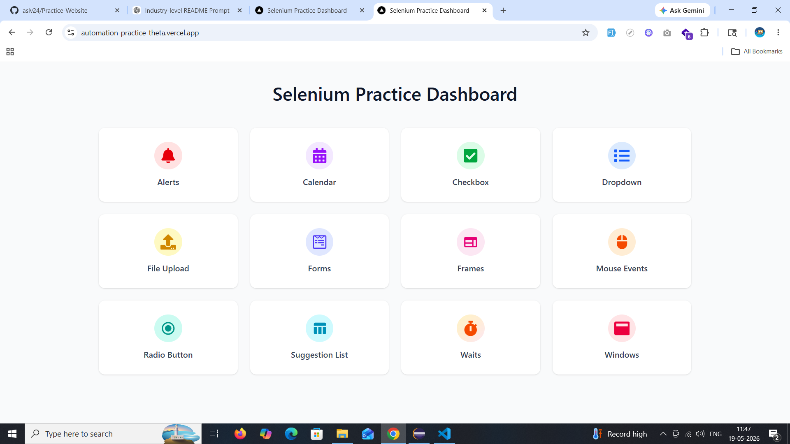 | 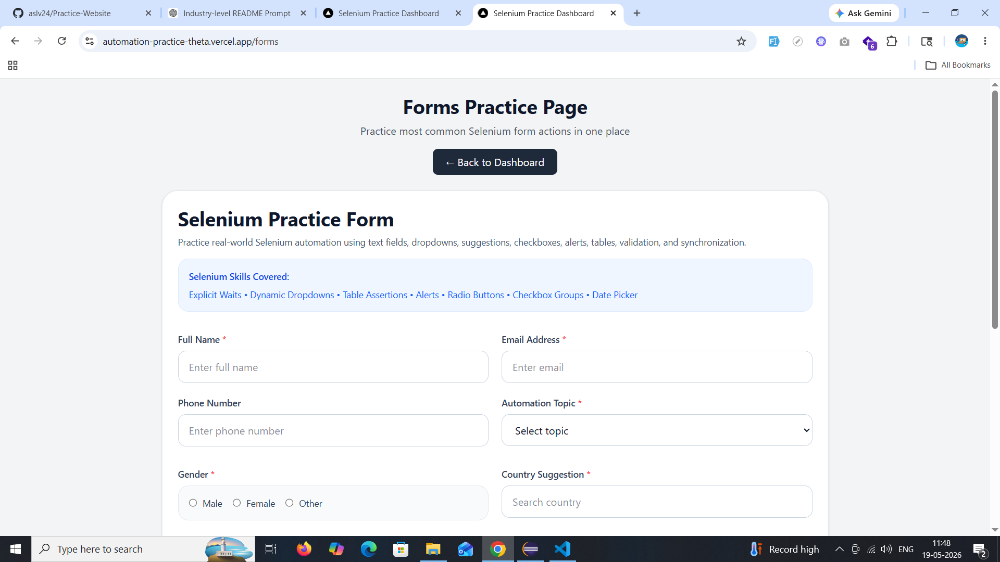 |

| Alerts | Calendar |
| --- | --- |
| 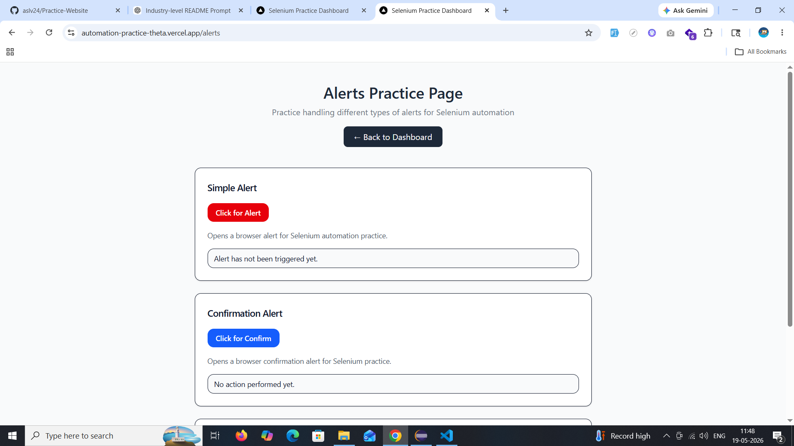 | 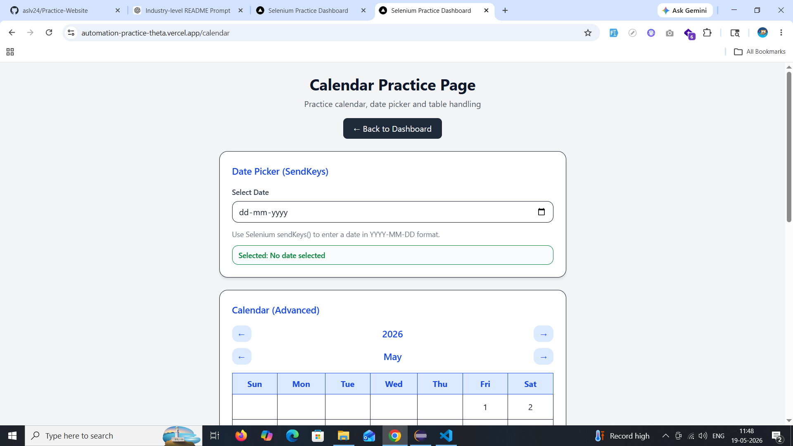 |

| Checkbox | Dropdown |
| --- | --- |
| 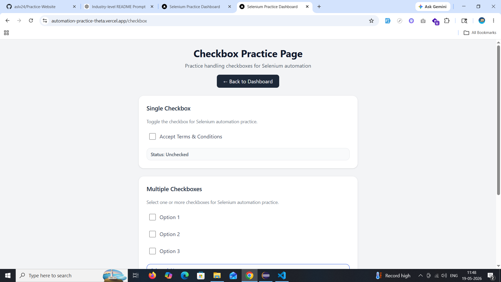 | 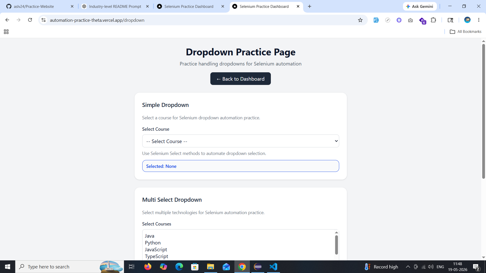 |

| File Upload | Frames |
| --- | --- |
| 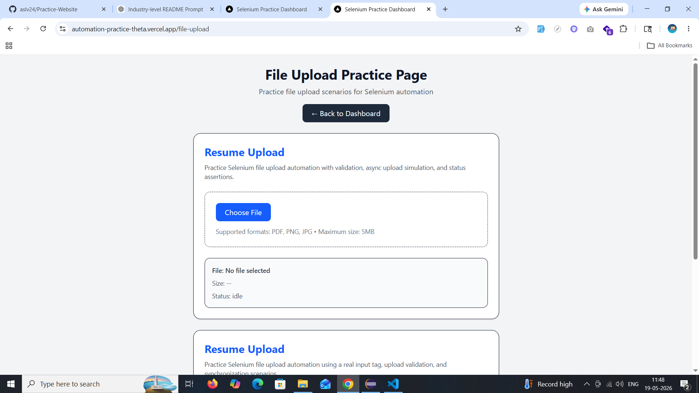 | 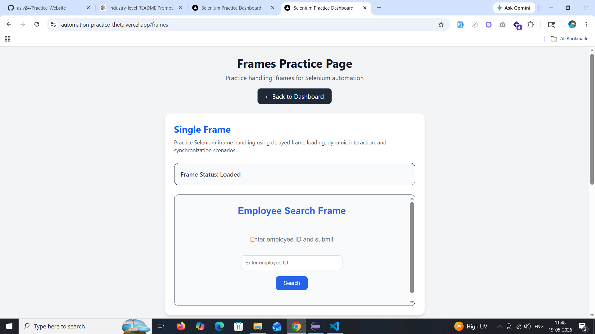 |

| Mouse Actions | Radio Button |
| --- | --- |
| 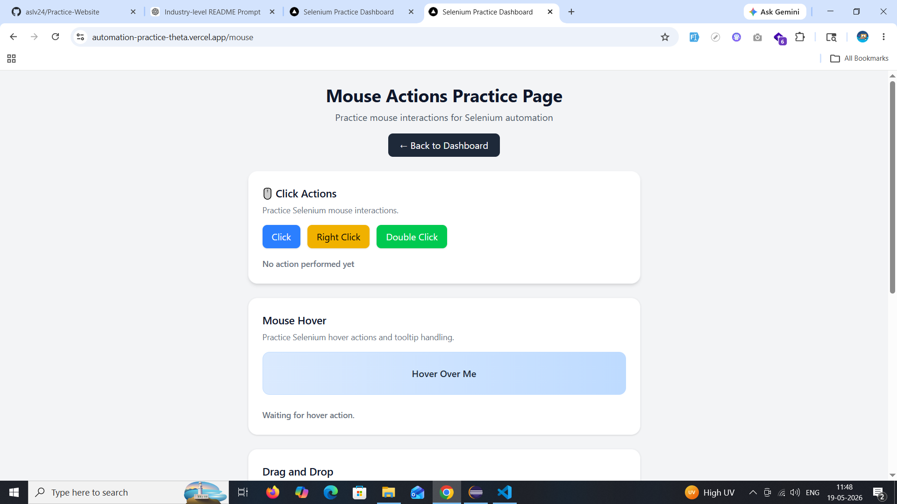 | 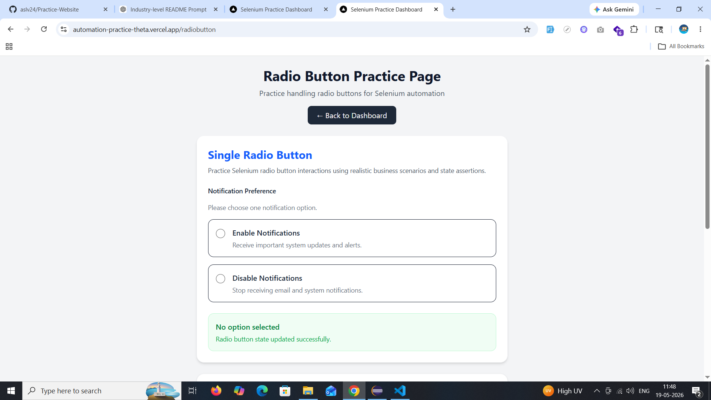 |

| Suggestion List | Waits |
| --- | --- |
| 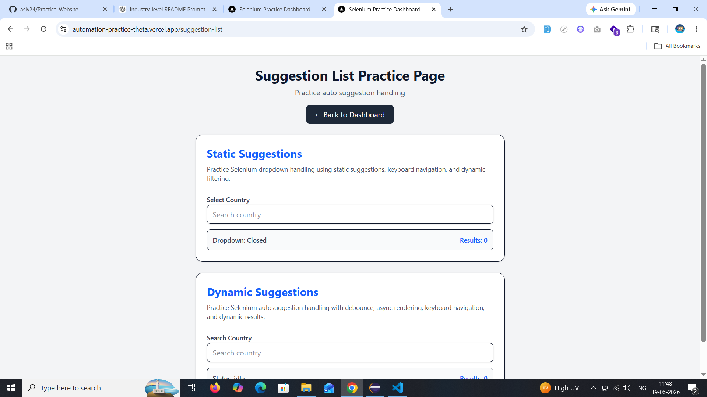 | 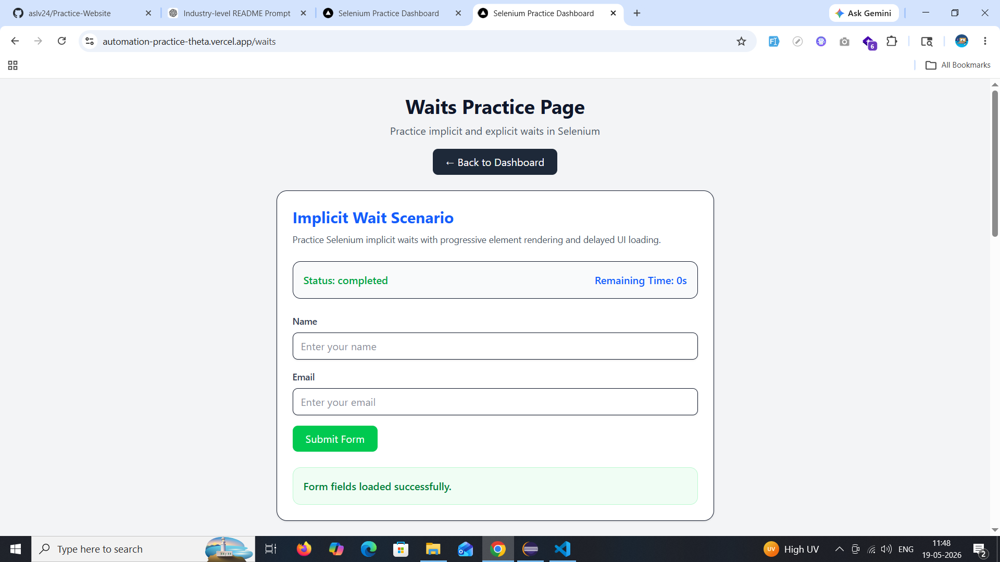 |

| Windows |
| --- |
| 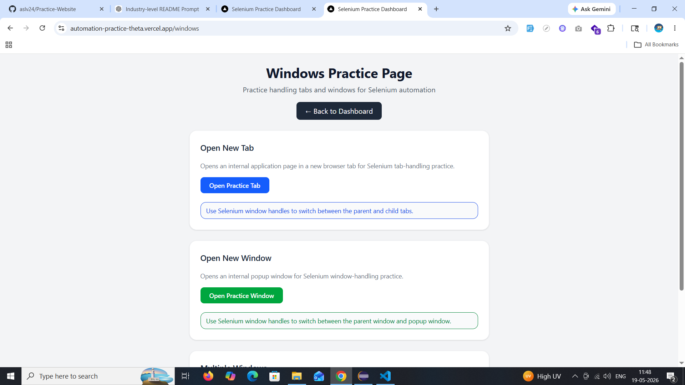 |

### Demo Video

TODO: Add a short walkthrough video showing dashboard navigation and Selenium practice flows.

### Live URL

```text
https://automation-practice-theta.vercel.app/
```

## Roadmap

- [ ] Add Selenium end-to-end test examples for every module.
- [ ] Add Playwright or Cypress smoke tests for CI validation.
- [ ] Add GitHub Actions workflow for lint, build, and tests.
- [ ] Add Docker production image support.
- [ ] Add custom `app/error.tsx` and `app/not-found.tsx` pages.
- [ ] Add screenshots and a hosted live demo link.
- [ ] Add accessibility testing with automated checks.
- [ ] Add structured documentation for locator strategies.
- [ ] Add downloadable sample Selenium scripts in Java, Python, and JavaScript.
- [ ] Add optional test data configuration for form and table scenarios.

## Contributing

Contributions are welcome once the repository is prepared for public collaboration.

Recommended workflow:

1. Fork the repository.
2. Create a feature branch.

   ```bash
   git checkout -b feature/your-feature-name
   ```

3. Install dependencies.

   ```bash
   npm install
   ```

4. Make focused changes with clear component boundaries.
5. Run quality checks.

   ```bash
   npm run lint
   npm run build
   ```

6. Commit with a descriptive message.

   ```bash
   git commit -m "Add practice scenario for dynamic tables"
   ```

7. Open a pull request with a summary, screenshots if UI changed, and testing notes.

Contribution standards:

- Keep module components focused and automation-friendly.
- Preserve stable selectors unless a breaking change is intentional.
- Prefer accessible labels and semantic HTML.
- Do not introduce backend, database, or authentication dependencies without documenting them.
- Update this README when scripts, deployment, APIs, or architecture change.

## License

No license file is currently included.

TODO: Add a license before distributing this project as open source. MIT is a common option for educational frontend practice projects, but the final license should be chosen by the repository owner.

## Author

**aslv24**

- GitHub: [@aslv24](https://github.com/aslv24)
- Repository: [Practice-Website](https://github.com/aslv24/Practice-Website)
- Email: aslinfomats@gmail.com

## Assumptions and Current Gaps

- The repository is currently frontend-only.
- No backend API, database, authentication layer, Docker setup, Kubernetes setup, or CI/CD workflow is present.
- The app is intended for Selenium automation practice based on page names, component behavior, selectors, and existing metadata.
- Environment variables listed in this README are future placeholders and are not currently required by the code.
